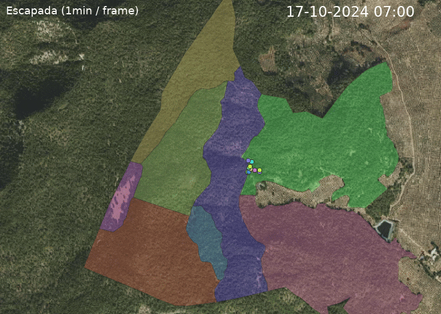

# Map Video Generator for QGIS

QGIS permite renderizar animaciones con su herramienta de línea de tiempo si los datos tienen atributos temporales.

Lo que hace QGIS es generar frames por cada intervalo de tiempo y guardarlos como imágenes en una carpeta.

Para convertir estos frames a un video he creado este script que usa el comando _ffmpeg_.

## USO

Descarga la última release (sección Releases de la derecha).

Ejecuta "**_RUN_ME_**" antes de nada.

Mete los frames generados del mapa en la carpeta "**_- frames_**".

Las imágenes de leyendas en la carpeta "**_- legend_images_**".

Configura todo en el "**_config.yaml_**".
Si no entiendes algo mira los detalles [más abajo](#configuración).

Y ejecuta "**Generar Videos de Mapas.exe**".

Los videos generados aparecerán en la carpeta "**_- videos_**"

### ¿Algo ha ido mal?

Ejecuta el test: "**TEST - Genera Videos de los mapas en test**".  
Generará unos videos de prueba en la carpeta "**_test_**".

Fíjate en el "**_test/config.yaml_**", que contiene la configuración de la prueba.  
Si la prueba tampoco funciona bien mándame la salida del terminal para que pueda ayudarte.

## CONFIGURACIÓN

Configura su funcionamiento con el archivo **_config.yaml_**.

### RUTAS

- **input_frames_folder_path**: Carpeta contenedora de las carpetas de frames de cada mapa.
- **output_videos_folder_path**: Carpeta contenedora de los videos que se generan
- **legend_images_folder_path**: Carpeta contenedora de las imágenes con la leyenda que quieras superponer al video

### Configuración de disposición global del texto

- **margin**: Margen del video para el texto (el timer y más)
- **char_width_by_font**: Ratio anchura de un caracter / el tamaño de letra
- **line_height_by_font**: Ratio altura de una línea de texto / el tamaño de let
- **line_height_by_font**: Ratio altura de una línea de texto / el tamaño de letra

### Estilo de cada texto

- **timer_text_style**: Estilo del texto del Timer
- **title_text_style**: Estilo del texto del Título
  - _font_size_: tamaño de letra.
  - _font_family_: Fuente de letra. Usa fuentes Mono para textos dinámicos como el Timer (el tamaño de caracter uniforme evita errores de posicionamiento del texto)
  - _color_: color del texto
  - _shadow_: true para que lleve una sombra

### MAPAS

"_**maps**_" Contiene la lista de mapas para automatizar la ejecución del script con varios mapas, cada uno con su configuración propia.  
Copia y pega cada bloque de mapa para generar otro mapa en el orden de la lista.

- **name**: Nombre del mapa. Debe coincidir con la carpeta que contiene sus frames y el nombre del video generado.
- **frame_name**: Nombre dinámico de cada frame (configurado en QGIS en su generación). Ejemplo: f%04d.png
- **framerate**: frames por segundo. Ejemplo: 2fps para un video de 5 minutos por frame => 10 minutos reales por segundo de video.

- **overlay_legend**: nombre de la imagen de leyenda que quieras superponer.

- **title**:
  - **text**: Texto del título. Dejar vacío para no añadir ningún título
  - **position**: Posición relativa del Título (top_left, top_right, bot_left, bot_right, middle_left, middle_right, center)

- **timer**:
  - **realtime_date**: true => Timer normal en tiempo real || false => Contador de días en vez de mostrar la fecha real
  - **show_date**: true => Muestra la fecha || false => solo muestra la hora
  - **show_start_and_end_date**: true => Añade las fechas de inicio y fin del video
  - **interval**: Intervalo frame - frame (1y = 1 year, 1M = 1 month, 1d = 1 day, 1h = 1 hour, 1m = 1 minute, 1s = 1 second).
  - **initial_datetime**: Fecha de comienzo del video. (dd-MM-YYYY hh:mm:ss)
  - **end_datetime**: Fecha final del video. (dd-MM-YYYY hh:mm:ss)
  - **position**: Posición relativa del Título (top_left, top_right, bot_left, bot_right, middle_left, middle_right, center)

## Requisitos

- [Python 3](https://www.python.org/downloads/)

(Las dependencias adicionales se instalan automáticamente al ejecutar el script convert_to_video.bat por primera vez)

## Código

Para probar o modificar el código clona el repositorio.

Dentro de src está todo el funcionamiento del programa.

### Compilación

Para compilarlo ejecuta:

```cmd
py _build_bundle.py
```

#### ¿Qué hace?

- Comprueba que estén las **dependencias** instaladas.
- **Compila el RUN ME.exe** con _pyInstaller_. Servirá dentro del bundle para crear los accesos directos.
- **Compila el bundle** con _pyInstaller_.  
El .spec se ejecuta en pyInstaller como un script de python, por lo que he añadido al final que ejecute el script setup_bundle.py.  
Puedes cambiar la versión y nombre del programa en el .spec.  
El cual:
  - **Inserta los assets** (archivos y carpetas necesarias para usar el programa, junto al .exe), y el RUN ME.exe, para ejecutarlo en el pc del usuario.  
Debe ejecutarse cuando el usuario tenga el bundle, ya que crea accesos directos dependientes de la ruta absoluta de su equipo.
  - **Comprime el bundle** en un .zip para publicar directamente.

## GIFS

Como recomendación propia, uso [ezgif.com](https://ezgif.com/video-to-gif) para sacar gifs de los videos generados.

Son mucho más ligeros y fáciles de usar para colgarlos en una web o almacenarlos.


